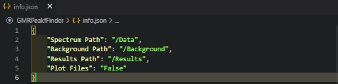

# Resonant Wavelength Analysis

This software is designed for analysis of resonant structures, namely the resonant peaks these structures produce. Specifically the software looks for fano-resonances in 1- or 2D resonant structures. To date, the software is designed for use with 1D resonant gratings.

This software was created by Josh Male in November 2022 as part of the ongoing analysis of resonant structures. The code is under an MIT License and can be freely used.

## Table of Contents

* [General Information](#general-information)
* [Package Requirements](#package-requirements)
* [Launch](#launch)
* [Setup](#setup)
  * [Directory Paths](#directory-paths)
  * [Spectrum File Names](#spectrum-file-names)
  * [Spectrum File Types](#spectrum-file-types)
  * [Default info.json](#default-info)
* [General Work Flow](#general-work-flow)
  * [Organisation](#organisation)
  * [Data Handling](#data-handling)
  * [Parent Directory](#parent-directory)
  * [Batch Processing](#batch-processing)
  * [Find File Paths](#find-file-paths)
* [Fano Resonance](#fano-resonance)
  * [Spectrum Data Input](#spectrum-data-input)
  * [Spectrum Normalise](#spectrum-normalise)
  * [Spectrum Analysis](#spectrum-analysis)
  * [Spectrum Results](#spectrum-results)
* [Acknowledgements](#acknowledgements)

## General Information

Semi-automatic fano resonant peak finder built using Python 3 to find the resonant wavelength in 1- and 2D resonant cavities. Suitable for all fano-resonance structures.

## Package Requirements

Language and package requirements can also be found in requirements.txt. The code was built using the following languages and module versions.

* Python 3.6
* tk 0.1.0
* numpy 1.21.4
* matplotlib 3.5.0
* scipy 1.7.2

## Launch

The code can be run from any terminal or editor. Main scripts are in the repository's main directory, while source code is stored safely in /src. The code relies on hte use of info.json file for non-windows operating systems, this should be kept in the main repository directory.

## Setup

### Directory Paths

The code relies heavily on the info.json file for non-windows operating systems for data and results directory paths, this is to relieve pressure from any users from altering the script, and to ensure user alterations don't break the code. The info.json file should contain the following file paths:

* {
    "Spectrum Path": "/relative/path/to/spectrum/measurements",
    "Background Path": "/relative/path/to/background/measurements",
    "Results Path": "/relative/path/to/results/directory",
    "Plot Files": "True/False"
}

Where the relative paths are relative to the root directory (main directory of the repository). Windows devices make use of tkinter's interactive path selector and are able to select target files directly, but will require background and results paths to be present. Default paths are set to:

* {
    "Spectrum Path": "/Spectrum",
    "Background Path": "/Background",
    "Results Path": "/Results",
    "Plot Files": "False"
}

The code is able to distinguish between spectrum and background files using the parent directory names "Spectrum" and "Background", so data should be stored in directories with the same names, though only "Background" is essential.

### Spectrum File Names

Handling data and information is always a challenging aspect of coding. It's far easier to convey specific file information within the file name itself than to have a bank of dictionaries, text files, or other storage format files somewhere with all the relevant information required for data processing. This software is no different, and as such, there are specific pieces of information that are required from the file name that need to be included, these are:

* Primary sample identifier string:
  * This may be a string like "A1", "Sample1", or "CharacterisationSample17". Either way, there must be some form of sample identifier within the file name.
  * This string must be one word.
* Secondary sample identifier string:
  * This is required for batch storage purposes and is used to group measurements from the same sample into one results dictionary and allows the dictionary keys to remain separate as to not overwrite data.
  * This string may be something like "P250" for a grating period 250nm, "Grating1", "SecondFromLeft", etc., and it must be one word.
* Integration time string:
  * The integration time string is an indicator telling the software the integration time at which the scan was taken.
  * This is required for both the scan file and the respective background file or neither of the images. In the instance where neither scan or background file contain an integration time, the integration time is given as 1s.
  * Integration time must be given in ms, and can either be given as 100int, int100, 100ms, or ms100 for an integration time of 100ms.
  * As with the other identifier strings, the integration string should be one word separated from other file information with an underscore.
* Polarisation string:
  * The polarisation string is an indicator telling the software whether the resonant mode observed is a transverse electric or transverse magnetic mode (TE or TM).
  * The polarisation string must be either "TM" or "TE" for the respective modes, and must also be present in the corresponding background file.
  * Once again, this should be separated from other file information using an underscore.
* The primary, secondary, integration, and polarisation sample identifier strings must be separated from each other, and the remaining information contained within the file name using the "_" character (underscore character).
  * An example file name would be - "A1_Grating_TE_int100_any_other_information.txt.
  * Primary and secondary identifier strings must be first and second in the file name string, but integration and polarisation strings can be anywhere in the file name.
  * Any information in the first two "_" separated segments will be called into the code regardless of their nature.

This is all that is required for files to be processed in this code. The main requirement is that the primary, secondary, and polarisation strings are the same in the scan file and background file, while the integration time may vary between the two. Any other information stored within the file name is carried through and ignored during processing. The strings will remain in any results dictionary. To, again, keep the process as simple as possible for the user, the primary and secondary identifier strings must be first and second in the file name.

### Spectrum File Types

The default output from Thorlabs spectrometers, the standard for most research groups, is a comma, or semicolon, delimited txt file with two columns (wavelength and intensity) with neither column labelled with headers. Therefore, this code is designed for use with exactly that type of file. The accepted files can be altered in src/fileIO.py but it is not recommended for the casual user. All output files are .json dictionaries, which is one of the standard file types for outputting data in python software. The software does not, by default, output any graphs, but this can be changed by altering the "Plot Files" key in the info dictionary to "True". Doing this will ensure that all figures are plotted from the fano-resonance fitting feature and saved to the results directory. Note that all figures are saved as png files.

### Default Info

As discussed in this section, all the user interface is done through the info.json file included in the main directory of the repository. This file can be opened using any text editor, and can be adjusted by the user with little-to-no consequence. The default info.json looks lik this:

## General Work Flow

This section contains general work flow details for code setup, data handling, batch processing, and a variety of other general features of the code.

### Organisation

The initial section of the code is concerned with finding directory and file paths required to process the data. This process is highly dependent on the operating system due to the relationship between tkinter and non-windows operating systems. The code makes use of pathlib's Path for file and directory paths, to maintain utility across operating systems, and sets the root directory as the main directory of the repository.

Details in the info.json setup file, including directory paths, are pulled in the function get_directory_paths, which builds the relative paths based on the set root path, which can be changed by adjusting the root variable. The directory paths is then treated as a dictionary containing the set directory paths by the user. File paths are returned as an array depending on operating system. If operating system is windows, the user can select which files they would like to process, if operating system is not windows, the user must have all desired files in the set directories as all files in those directories will be processed.

### Data Handling

Primary, secondary, and any other identifier strings are pulled from the file name string using a sample_information function, which pulls all required parameters for the code from the file name and places them in a dictionary with clear identifier keys. The values of this dictionary are then used throughout the code to pull in required parameters. Therefore, this dictionary is referred to as sample_parameters throughout.

### Parent Directory

Parent directory is discussed above in directory paths. The code relies on relevant data being stored in the correctly named directory, allowing the code to distinguish between different file types. The parent directory names should be clear as discussed above. The parent directory is found using the function get_parent_directory, which returns a string of the parent directory name, which is then used as a parameter identifier key throughout.

### Batch Processing

For batch processing, indicated by the batch_ in either the script name or function name, the code then looks for like-filme names, typically with the same primary identifier string, and groups them together separated by secondary identifier string.

Batches are found using find_all_batches function, which matches primary identifier strings, groups the file names, file paths, and secondary string names together and returns a batch dictionary.

Using the batch keys and file paths stored within the batches dictionary, the code begins by pulling file names, file paths, and secondary identifer strings into a batch results dictionary and appending each subsequent file parameters into an array under the appropriate keys. The parent directory is used from here as a key identifier. The batch results utilises sample_information function in filepaths to pull this information in.

### Find File Paths

As discussed above, finding file paths is operating system dependent. On windows operating systems, the code uses tkinter's interactive file selection tool and allows the user to select any of the files in a directory they would like to process. In other operating systems, where tkinter is not so native, the code looks for all suitable files within the data directory and will process all of them, unless results have already been optained and the results file exists.

## Fano Resonance

This section contains work flow details to better understand how the code is put together and what processes are undertaken in finding the Fano Resonances of a periodic structure.

### Spectrum Data Input

Data is pulled in using the read_GMR_file function, where the scan wavelength and raw intensity from the target file are pulled into separate arrays from a txt file. The delimiter in the file can either be a semicolon or a comma and the result is the same.

Important information from the file is pulled into a dictionary using the sample_information function discussed above. The same process is then applied to the relevant background spectrum file. In the situation where a background file does not exist, the find_background function will return an empty list and the background_parameters dictionary will contain a default string.

### Spectrum Normalise

The spectrum file is then normalised, depending on the presence of a background spectrum this can be done in one of two ways. Firstly, without a background spectrum, the raw intensity is normalised by doing an integration time correction, and then normalising by dividing every intensity value by the max value in the file. This is a common process for non-background normalised data.

In the instance where a background file is present, the code firstly looks for the relevant integration times for both spectra. For instances where the integration time for background and spectrum are not the same, the normalisation process uses a scaling factor, integration time / background integration time, to scale up the intensity values in the raw intensity array to the same level as the background spectrum. From there, the data is divided by the background intensity to perform a standard background normalisation.

### Spectrum Analysis

To calculate the peak wavelength of a fano resonance in a resonant structure, we first need to understand the fano resonance equation. Fano resonances are discussed to great length in M. Limonov's 2017 Nature Photonics Paper: [Fano Resonances In Photonics](https://www.nature.com/articles/nphoton.2017.142), and I will try to give a brief summary here. All equations considered in this code, regarding fano resonances, are taken from this paper.

Fano resonance occurs when a discrete quantum state interferes with a continuum band of states, and it is manifested in the absorption spectrum y(E), with shape described by:

* y(E) = A2$\frac{(q + \Omega)^2}{(q + \Omega^2)}$

Where q is the fano parameter, $\Omega$ = 2(E - E0)/$\Gamma$, where $\Gamma$ and E0 are the resonance width and energy, respectively. This equation is generally applicable to absorption, optical transmission, and scattering spectra for a variety of systems. If fano resonances are of further interest, a thorough read of the above [paper](https://www.nature.com/articles/nphoton.2017.142) is highly recommended.

The code makes use of scipy's optimise curve fit function to vary the required fano parameters and optimise based on the real experimental data. Initial guesses for $\Gamma$, q, A, and the damping fano parameters are given, but the most important is to find the peak wavelength. To give the code a start, this is done utilising matplotlib's region of interest selector tool. An example of this tool is shown below, simply select a rectangle around the peak you wish to fit a fano resonance to:

Using the region of interest selected, the code then trims the wavelength and normalised intensity arrays to the desired region of interest. Scipy optimise optimises the fano resonance parameters and returns them as a dictionary. The errors to these fano parameters are also returned. Results are given in dictionary format to be concatenated to the sample parameters.

In the instance that scipy optimise can't find a resonant peak, the function hits a run time error. The code can deal with this, and returns all values for fano parameters and errors as 0, printing a run time error message to the output and continuing with any subsequent files. Assuming the fano resonance can be found, and plot files is set to "True", the output will resemble something like:

### Spectrum Results

Results are outputted as a dictionary format, combined with sample parameters from the file name, background file information if relevant, and trim indices for the region of interest. In the case of batch processing, results are batched together in the batch results json, with the secondary identifier string given as the unique key for each file in the batch.

## Acknowledgements

Thanks go to George for assisting with fano resonance fitting.
